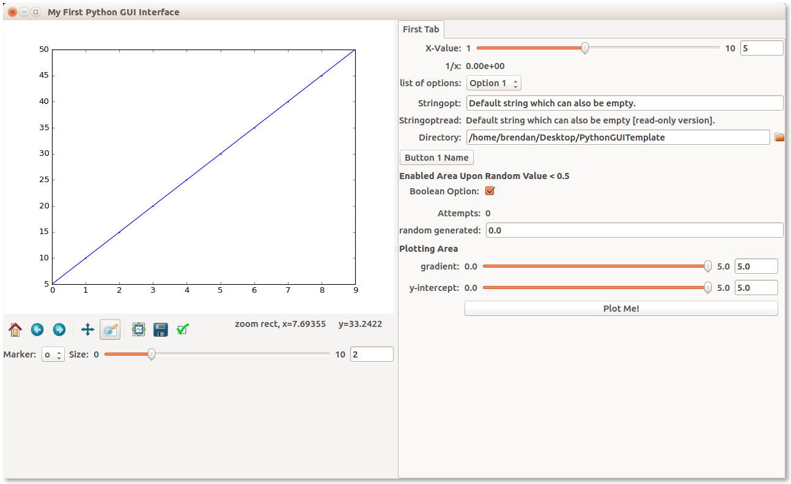

Python33 GUI Template (using qt4+matplotlib)
=================




This template is an improved and upgrade template made from the pieces of my [Python2Template](https://github.com/bgriffen/PythonGUITemplate). I've removed MayAvi and reduced it to the simplest components of Traits/TraitsUI+Matplotlib. The key difference here is that the backend is QT4 which leans heavily on the code found [here](https://gist.github.com/pierre-haessig/9838326).

## Requirements

I've stripped back the requirements and wrapped it all up in a conda environment file as the key to getting this working at the relevant version dependencies. There are two options to get you going, either:

```
conda-env create --file Python3GUITemplate.yml

```

OR

```
conda create --name ENVIRONMENTNAME --file Python3GUITemplate.yml
```

## Getting Started

To run this program, you simply load your environment and run.

```
source activate Python3GUITemplate
python main.py
```

There is very comprehensive documentation on using Traits [here](http://code.enthought.com/projects/traits/documentation.php) and a lot of [tutorials](http://docs.enthought.com/traitsui/tutorials/index.html). I have some additional information relating to the Traits/TraitsUI functionality found here (that post is based on the old Python2 version) [blog](http://brendangriffen.com/creating-a-GUI-in-Python/) as well.

There is an additional script `standalonematplotlib.py` which just demonstrates the matplotlib functionality. 
